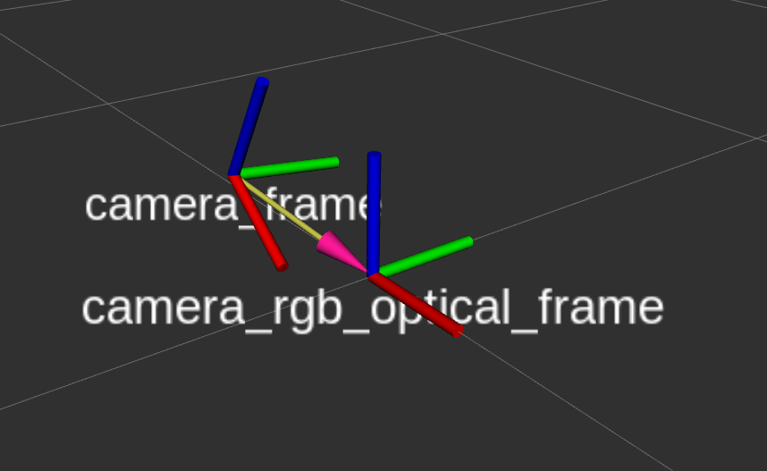

# Dual Extrinsic Calibration

Relative TF frames after calibration visualized in rviz


This package provides a tool for:
- a) calibrating two cameras extrinsically,
- b) publishing their relative transform to tf tree.

## Dependencies

- Install Eigen C++ library version 3.4:
Download headers from http://eigen.tuxfamily.org/index.php?title=Main_Page#Download and replace Eigen lib in
usr/include/eigen3 with the downloaded files.

## Install
```
git clone  https://git.tu-berlin.de/rbo/robotics/dual_extrinsic_calibration/-/tree/main?ref_type=heads
cd catkin_ws/
catkin_make
```
## Settings
This package requires two calibrated cameras. Edit calibration.launch file and provide names of camera info topics, camera image topics as well as camera optical axis of parent tf frame. 

## Run 
Make sure both cameras are running and required image and info topics are published. Next, launch calibration.launch to start the calibration tool.

```
roslaunch dual_extrinsic_calibration calibration.launch
```
A successfull launch will open rviz with parent tf frame (camera optical axis) along with both images of left and right camera. 
The tool can be used in two modes.
### Option a) Single Calibration
The single calibration mode is entered by pressing "space bar" on one of the two camera windows. Every space bar event will compute and store a relative transformation between the two cameras. The calibration finishes as soon as 10 transforms were computed by calculating the average transformation over the previously collected transformations. After successfull calibration the relative camera pose is published on the tf tree.
### Option b) Continuous Calibration
The continuous mode can be accssed by pressing the "c" key on one of the two camera windows. The tool will continuously compute transforms on every incoming set of images and compute the average transform after 10 individual transforms are generated. After successfull calibration the relative camera pose is published on the tf tree.

Press "q" to quit. 
